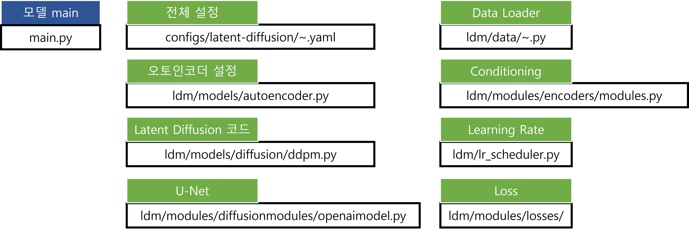

# Capstone Design in ICT, Spring 2023
## git 사용
```
git checkout <브랜치>
git pull origin main
# 파일 수정
git commit -am "<코맨트>"
git push
# pull request
```

# Environment
```
conda env create -f environment.yaml
conda activate ldm
```
* 코드 구조
<br> 
High-Resolution Image Synthesis with Latent Diffusion Models](https://arxiv.org/abs/2112.10752)를 베이스라인으로 사용


# 데이터 구성 및 전처리
density_shanghai.py 를 통해 원본 RGB 이미지에 Gaussian kernel을 적용하여 density map을 생성

Conditioning (조건 입력):
원본 RGB 이미지를 사용하며, 별도의 모델 없이 단순히 rescale 처리를 진행함

데이터 경로:
```
train/train_data/train_density_amh/DENSITY_*.png   # Density map 경로
train/train_data/train_img_amh/IMG_*.png           # RGB 이미지 경로
```
데이터 로더:
``latent-diffusion/ldm/data/shanghai_amh.py``
# Encoding
## Density Encoding (First Stage)
Pretrained VQ 모델 사용 https://ommer-lab.com/files/latent-diffusion/vq-f4.zip

특징:
  - 4x downsample (f = 4)
  - VQ embedding space: Z = 8192, latent dim d = 3

다운로드한 모델은 다음 경로에 위치
``models/first_stage_models/vq-f4/model.ckpt``

## RGB Conditioning Encoding
별도의 인코딩 모델 없이 RGB 이미지를 rescale하여 사용하거나 Pretrained FrozenCLIPEmbedder 사용 가능

# Run
```
python latent-diffusion/main.py --base configs/latent-diffusion/shanghai_amh.yaml -t --gpus 0, 
```
